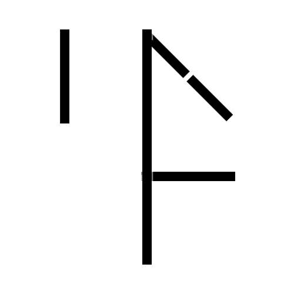

# Runic Numeral System – Composite Glyph Generator

This Processing sketch generates composite glyphs for numbers using a custom runic numeral system. Each number (from **0 to 9999**) is decomposed into four digits (thousands, hundreds, tens, ones) and rendered in separate quadrants around a central vertical line. The glyphs are constructed using digital clock–style segments with adjustable opacity, ensuring that segments in the "off" state appear at 50% opacity while "on" segments are fully opaque.

## Features

- **Custom Runic Numerals:**  
  Each digit is represented by a unique combination of five line segments:
  - The top segment represents a value (1, 10, 100, or 1000) depending on the quadrant.
  - The bottom, diagonal, and vertical segments similarly contribute their values.
  - Combinations of segments form numbers 1–9.
  
- **Quadrant Layout:**  
  - **Upper Right (Ones):** Drawn normally.
  - **Upper Left (Tens):** Flipped horizontally.
  - **Lower Right (Hundreds):** Flipped vertically.
  - **Lower Left (Thousands):** Flipped both horizontally and vertically.

- **Opacity Control:**  
  - "On" segments are rendered in black at 100% opacity.
  - "Off" segments are rendered in white at 50% opacity.

- **Z-Order Rendering:**  
  Off segments are drawn first (in the back) and on segments are drawn afterward (in the front).

- **Central Vertical Line:**  
  A 5-pixel-wide central vertical line spans the full vertical extent of the composite glyph.

- **Frame Export:**  
  The sketch runs at 10 fps and saves each frame as a PNG file in the `frames` folder.

- **High Resolution Option:**  
  Increase pixel density (e.g., using `pixelDensity(displayDensity())`) to smooth out diagonal segments if needed.

## Sample Images





## Setup and Usage

1. **Requirements:**  
   - [Processing (Java mode)](https://processing.org/download/)
   - Python 3

2. **Installation:**  
   - Clone this repository to your local machine.
   - Load the `.java` file in the Processing IDE.

3. **Configuration:**  
   - Modify the `minNumber` and `maxNumber` variables in the code to change the range (currently set to **0–9999**).
   - Adjust segment dimensions, gap sizes, and opacity values as desired.
   - Increase the pixel density by adding `pixelDensity(displayDensity());` in the `setup()` function if necessary.

4. **Running the Sketch:**  
   - Run the sketch in Processing.
   - The sketch will render composite runic glyphs for each number, saving each frame as a PNG in the `frames` folder (e.g., `num_0000.png`, `num_0001.png`, etc.).

5. **Customization:**  
   - Update the `runePatterns` array to modify which segments are "on" or "off" for each digit.
   - Adjust the `initSegments()` function to tweak the appearance of each segment.
   - Modify quadrant transformations in `drawCompositeGlyph()` to change how digits are flipped and positioned.
  
## Video Creation Options

In addition to generating individual composite glyph images from Processing, two options are provided via a Python script for creating a video from these images using ffmpeg.

### Option 1: Standard Base-10,000 Conversion

- **Logic:**  
  Each composite glyph is constructed by converting the frame number to a series of runic digits using standard base-10,000 arithmetic.  In the standard base‑10,000 conversion method, each composite glyph is formed by converting the frame number into a sequence of runic digits, where each digit ranges from 0 to 9999. The rightmost (least-significant) digit cycles normally through 0–9999. For example:

- **Frame 10,000:**  
  Represented as `[1, 0]` (i.e., 1 × 10,000 + 0).

- **Frame 15,000:**  
  Represented as `[1, 5000]` (i.e., 1 × 10,000 + 5000).

- **Frame 30,578:**  
  Represented as `[3, 578]` (i.e., 3 × 10,000 + 578).

- **Frame 68,983:**  
  Represented as `[6, 8983]` (i.e., 6 × 10,000 + 8983).
  
- **Behavior:**  
  The least-significant digit (LSB) cycles normally (i.e. it resets to 0 after 9999), and additional digits are added to the left as needed.
  
- **Use Case:**  
  This option is useful if you prefer a traditional numeral system behavior where every digit has its full cycle. It is also much more concise and gives a higher range with fewer digits.

### Option 2: Saturated (Clamped) Conversion

- **Logic:**  
  Alternatively, a "saturated" conversion option is available. In this system, each runic digit can only represent values from 0 to 9999. When the frame number exceeds 9999, the least-significant digit is clamped at **9999**, and the overflow is carried to a new digit on the left. 
 
- **Frame 10,000:**  
  Calculation: 10,000 − 9,999 = 1  
  Representation: `[1, 9999]`

- **Frame 15,000:**  
  Calculation: 15,000 − 9,999 = 5001  
  Representation: `[5001, 9999]`

- **Frame 30,578:**  
  Calculation:  
  1. 30,578 − 9,999 = 20,579  
  2. 20,579 − 9,999 = 10,580  
  3. 10,580 − 9,999 = 581  
  Representation: `[581, 9999, 9999, 9999]`

- **Frame 68,983:**  
  Calculation:  
  1. 68,983 − 9,999 = 58,984  
  2. 58,984 − 9,999 = 48,985  
  3. 48,985 − 9,999 = 38,986  
  4. 38,986 − 9,999 = 28,987  
  5. 28,987 − 9,999 = 18,988  
  6. 18,988 − 9,999 = 899  
  Representation: `[899, 9999, 9999, 9999, 9999, 9999, 9999]`
  
- **Behavior:**  
  This method ensures that the rightmost runic symbol is always fixed at its maximum value (9999) once an overflow occurs. The layout remains constant, as unused (placeholder) positions are rendered with the runic zero.  
  This prevents any changes in composite image dimensions across frames.
  
- **Use Case:**  
  Use this option if you prefer cumulative effect of each digit placement which can be easier to observe the scale of the number being represented. However, it is not as concise and requires more digits.

### How to Create the Video

A Python script is provided that takes three command-line arguments:  
- **fps:** Frame rate for the video (e.g., `30`)
- **duration:** Duration of the video in seconds (e.g., `1.0`)
- **filename:** Output video filename (e.g., `output.mp4`)

The script performs the following:
1. **Calculates the Total Number of Frames:**  
   `total_frames = fps * duration`
2. **Converts Each Frame Number:**  
   - For the standard option, it uses normal base-10,000 conversion.
   - For the saturated option, it clamps the least-significant digit at 9999 and carries overflow to a new digit on the left.
3. **Generates Composite Images:**  
   Composite images are created by concatenating the individual runic digit images (from the `frames` folder). Placeholder runic zeros are used for any digits that are not yet used, ensuring a constant composite layout.
4. **Creates the Video Using ffmpeg:**  
   The script calls ffmpeg via a subprocess to compile the composite images into a video.

**Example Command:**

```python create_video.py 30 1.0 output.mp4```

## License

This project is licensed under the MIT License. See the [LICENSE](LICENSE) file for details.

## Author

*Nick Newell* - [GitHub Profile](https://github.com/blotto)

## Acknowledgments

- Inspired from this [reddit post](https://www.reddit.com/r/coolguides/comments/wscf8f/cool_guide_to_cistercian_numerals/) and this [article](https://www.zmescience.com/feature-post/natural-sciences/mathematics/cirstercian-numbers-90432432/)
- Inspiration from digital clock displays and custom numeral systems.
- The Processing community for their extensive documentation and support.
- Use of ChatGPT o3-mini-high


